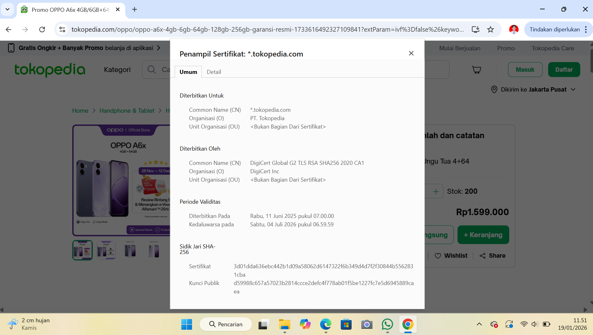

# Laporan Praktikum Kriptografi
Minggu ke-: 12 
Topik: [Aplikasi TLS & E-commerce]  
Nama: [Nanda Erdi Pratama]  
NIM: [230202770]  
Kelas: [5IKRB]  

---

## 1. Tujuan
Setelah mengikuti praktikum ini, mahasiswa diharapkan mampu:  
1. Menganalisis penggunaan kriptografi pada **email** dan **SSL/TLS**.  
2. Menjelaskan enkripsi dalam transaksi **e-commerce**.  
3. Mengevaluasi isu **etika & privasi** dalam penggunaan kriptografi di kehidupan sehari-hari.  
---

## 2. Dasar Teori
Teori kriptografi merupakan dasar penting dalam pengamanan komunikasi digital. Kriptografi adalah ilmu yang mempelajari teknik penyandian data agar informasi hanya dapat dibaca oleh pihak yang berwenang. Pada tahap awal, kriptografi menggunakan cipher klasik seperti Caesar Cipher dan Vigenère Cipher yang mengandalkan pergeseran huruf atau penggunaan kunci sederhana untuk menyamarkan pesan.

Salah satu konsep matematika yang mendasari kriptografi adalah aritmetika modular, yaitu operasi matematika dengan sistem sisa pembagian. Aritmetika modular digunakan dalam proses enkripsi dan dekripsi untuk membatasi nilai bilangan dalam rentang tertentu, misalnya pada representasi huruf alfabet. Konsep ini menjadi fondasi bagi algoritma kriptografi modern.

Dalam perkembangannya, kriptografi modern menggabungkan teori matematika, algoritma, dan protokol keamanan seperti TLS, yang memanfaatkan enkripsi simetris, asimetris, serta fungsi hash. Penerapan teori-teori tersebut memungkinkan terciptanya komunikasi digital yang aman, menjaga kerahasiaan, integritas, dan keaslian data.
---

## 3. Alat dan Bahan
(- Python 3.x  
- Visual Studio Code / editor lain  
- Git dan akun GitHub  
- Library tambahan (misalnya pycryptodome, jika diperlukan)  )

---

## 4. Langkah Percobaan
(Tuliskan langkah yang dilakukan sesuai instruksi.  
Contoh format:
1. Membuat file `caesar_cipher.py` di folder `praktikum/week2-cryptosystem/src/`.
2. Menyalin kode program dari panduan praktikum.
3. Menjalankan program dengan perintah `python caesar_cipher.py`.)

---

## 5. Source Code
(Salin kode program utama yang dibuat atau dimodifikasi.  
Gunakan blok kode:

```python
# contoh potongan kode
def encrypt(text, key):
    return ...
```
)

---

## 6. Hasil dan Pembahasan
(- Lampirkan screenshot hasil eksekusi program (taruh di folder `screenshots/`).  
- Berikan tabel atau ringkasan hasil uji jika diperlukan.  
- Jelaskan apakah hasil sesuai ekspektasi.  
- Bahas error (jika ada) dan solusinya. 

Hasil eksekusi program Caesar Cipher:




)

---

## 7. Jawaban Pertanyaan
(Jawab pertanyaan diskusi yang diberikan pada modul.  
- Pertanyaan 1: Perbedaan utama antara HTTP dan HTTPS terletak pada keamanan data.
HTTP (HyperText Transfer Protocol) mengirimkan data tanpa enkripsi, sehingga informasi dapat dengan mudah disadap atau dimodifikasi oleh pihak tidak berwenang.
Sementara itu, HTTPS (HyperText Transfer Protocol Secure) menggunakan TLS/SSL untuk mengenkripsi data, sehingga komunikasi antara klien dan server menjadi aman, terjaga kerahasiaannya, dan terjamin keasliannya.
- Pertanyaan 2: Sertifikat digital berfungsi untuk memverifikasi identitas server dan mencegah serangan man-in-the-middle.
Dalam komunikasi TLS, sertifikat digital:
1.Menjamin bahwa server yang diakses adalah server yang sah
2.Menyediakan kunci publik untuk proses enkripsi
3.Diterbitkan oleh Certificate Authority (CA) yang terpercaya
Dengan adanya sertifikat digital, pengguna dapat mempercayai keamanan dan keaslian layanan yang diakses.
- Pertanyaan 3: Kriptografi mendukung privasi dengan cara melindungi kerahasiaan, integritas, dan autentikasi data dalam komunikasi digital, sehingga informasi pribadi tidak mudah diakses oleh pihak yang tidak berwenang. Namun, di sisi lain kriptografi juga menimbulkan tantangan hukum dan etika, karena teknologi enkripsi dapat digunakan untuk menyembunyikan aktivitas ilegal, menghambat proses penegakan hukum, dan memicu perdebatan mengenai keseimbangan antara hak privasi individu dan kepentingan keamanan publik.
)
---

## 8. Kesimpulan
Berdasarkan percobaan, penerapan TLS pada aplikasi e-commerce terbukti mampu mengamankan proses komunikasi data antara pengguna dan server melalui mekanisme enkripsi dan autentikasi. TLS melindungi informasi sensitif seperti data login dan transaksi dari penyadapan maupun manipulasi. Dengan demikian, penggunaan TLS meningkatkan kepercayaan pengguna serta keamanan sistem e-commerce secara keseluruhan.
---

## 9. Daftar Pustaka
(Cantumkan referensi yang digunakan.  
Contoh:  
- Katz, J., & Lindell, Y. *Introduction to Modern Cryptography*.  
- Stallings, W. *Cryptography and Network Security*.  )

---

## 10. Commit Log

```
commit c85be1276b610fb99492e913856c90dc6c3c58bd 
Author: Nanda0218 <nandaerdipratama29@gmail.com>
Date:   Mon Jan 19 11:59:09 2026 +0700

    week12-aplikasi-tls
```
