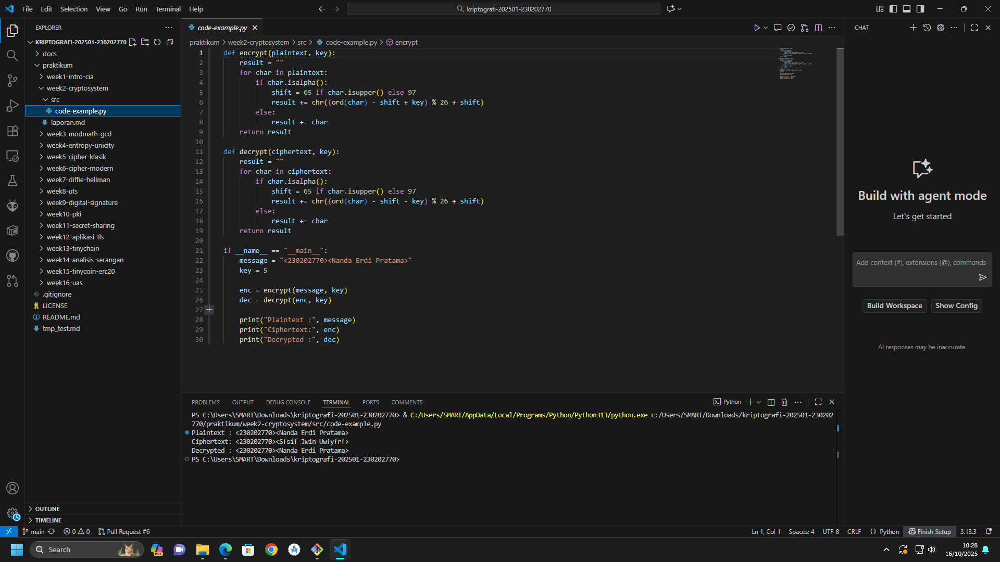

# Laporan Praktikum Kriptografi
Minggu ke-: 2
Topik: [Cryptosystem (Komponen, Enkripsi & Dekripsi, Simetris & Asimetris)]  
Nama: [Nanda Erdi Pratama]  
NIM: [230202770]  
Kelas: [5IKRB]

---

## 1. Tujuan
Setelah mengikuti praktikum ini, mahasiswa diharapkan mampu:  
1. Mengidentifikasi komponen dasar kriptosistem (plaintext, ciphertext, kunci, algoritma).  
2. Menggambarkan proses enkripsi dan dekripsi sederhana.  
3. Mengklasifikasikan jenis kriptosistem (simetris dan asimetris).  


---

## 2. Dasar Teori
Teori Dasar Kriptografi Klasik dan Modular Aritmetika

Kriptografi klasik didominasi oleh cipher substitusi dan cipher transposisi. Cipher substitusi mengganti setiap karakter plaintext dengan karakter ciphertext lainnya, seperti Caesar cipher yang menggeser huruf sejauh 3 posisi (A→D, B→E, dst). Cipher transposisi mengatur ulang pos karakter plaintext tanpa mengubah karakternya sendiri, seperti columnar transposition yang menulis plaintext dalam kolom lalu membacanya menurut pola tertentu. Kekuatan cipher-cipher ini bergantung pada kerahasiaan algoritmanya, bukan kunci—pendekatan yang kini dianggap tidak aman (security through obscurity). Konsep matematika yang mendasari banyak cipher klasik dan modern adalah modular aritmetika (atau aritmetika jam). Operasi modular bekerja dalam sistem bilangan melingkar dengan batas tertentu disebut modulus. Misalnya, dalam modulus 26 (untuk 26 huruf alfabet), operasi 25 + 3 = 28 ≡ 2 mod 26 (karena 28 ÷ 26 = 1 sisa 2). Caesar cipher secara matematis dapat dinyatakan sebagai C ≡ (P + k) mod 26, dimana P adalah plaintext, k adalah kunci geser, dan C adalah ciphertext. Dekripsinya adalah P ≡ (C - k) mod 26.

Perkembangan kriptografi modern memperkenalkan Prinsip Kerja Shannon yang menyatakan bahwa keamanan sistem harus bergantung pada kerahasiaan kunci, bukan kerahasiaan algoritma. Ini mengarah pada sistem kunci simetris** dimana kunci yang sama digunakan untuk enkripsi dan dekripsi, dengan keamanan berdasarkan konfusi (membuat hubungan antara kunci-ciphertext kompleks) dan difusi (menyebarkan pengaruh satu karakter plaintext ke banyak karakter ciphertext).

---

## 3. Alat dan Bahan
(- Python 3.x  
- Visual Studio Code / editor lain  
- Git dan akun GitHub  
- Library tambahan (misalnya pycryptodome, jika diperlukan)  )

---

## 4. Langkah Percobaan
(Tuliskan langkah yang dilakukan sesuai instruksi.  
Contoh format:
1. Membuat file `caesar_cipher.py` di folder `praktikum/week2-cryptosystem/src/`.
2. Menyalin kode program dari panduan praktikum.
3. Menjalankan program dengan perintah `python caesar_cipher.py`.)

---

## 5. Source Code
(Salin kode program utama yang dibuat atau dimodifikasi.  
Gunakan blok kode:

def encrypt(plaintext, key):
    result = ""
    for char in plaintext:
        if char.isalpha():
            shift = 65 if char.isupper() else 97
            result += chr((ord(char) - shift + key) % 26 + shift)
        else:
            result += char
    return result

def decrypt(ciphertext, key):
    result = ""
    for char in ciphertext:
        if char.isalpha():
            shift = 65 if char.isupper() else 97
            result += chr((ord(char) - shift - key) % 26 + shift)
        else:
            result += char
    return result

if __name__ == "__main__":
    message = "<230202770><Nanda Erdi Pratama>"
    key = 5

    enc = encrypt(message, key)
    dec = decrypt(enc, key)

    print("Plaintext :", message)
    print("Ciphertext:", enc)
    print("Decrypted :", dec)
)

---

## 6. Hasil dan Pembahasan
(- Lampirkan screenshot hasil eksekusi program (taruh di folder `screenshots/`).  
- Berikan tabel atau ringkasan hasil uji jika diperlukan.  
- Jelaskan apakah hasil sesuai ekspektasi.  
- Bahas error (jika ada) dan solusinya. 

Hasil eksekusi program Caesar Cipher:




)

---

## 7. Jawaban Pertanyaan
(Jawab pertanyaan diskusi yang diberikan pada modul.  
- Pertanyaan 1: Komponen Utama Kriptosistem:
Plaintext - Data asli (pesan, file).
Ciphertext - Data terenkripsi (hasil acakan).
Kunci - Data rahasia untuk enkripsi & dekripsi.
Algoritma - Metode untuk mengubah plaintext ↔ ciphertext.
Intinya: Algoritma mengambil plaintext dan kunci untuk menghasilkan ciphertext. Proses sebaliknya menggunakan kunci yang sama untuk mengembalikan ciphertext menjadi plaintext.
- Pertanyaan 2: Kelebihan Kriptografi Simetris (vs Asimetris):
1.  Jauh Lebih Cepat - Efisien untuk enkripsi data dalam jumlah besar.
2.  **Sumber Daya Rendah - Cocok untuk perangkat terbatas (IoT, mobile).
3.  Lebih Kuat - Kunci yang lebih pendek memberikan tingkat keamanan setara.
4.  Implementasi Sederhana - Hanya menggunakan satu kunci.

Kelemahan Kriptografi Simetris (vs Asimetris):
1.  Masalah Distribusi Kunci - Kesulitan mengirimkan kunci rahasia dengan aman.
2.  Tidak Ada Non-Repudiation - Tidak bisa membuktikan asal pesan karena kunci dibagi.
3.  Manajemen Kunci Rumit - Membutuhkan terlalu banyak kunci unik untuk banyak pengguna.
4.  Fungsi Terbatas - Hanya untuk enkripsi, tidak untuk tanda tangan digital.

Kesimpulan:
Keduanya saling melengkapi. Asimetris (RSA/ECC) digunakan untuk membangun kepercayaan dan menukar kunci, lalu Simetris (AES) digunakan untuk mengenkripsi data utama secara cepat.
- Pertanyaan 3: 
)
---

## 8. Kesimpulan
(Tuliskan kesimpulan singkat (2–3 kalimat) berdasarkan percobaan.  )

---

## 9. Daftar Pustaka
(Cantumkan referensi yang digunakan.  
Contoh:  
- Katz, J., & Lindell, Y. *Introduction to Modern Cryptography*.  
- Stallings, W. *Cryptography and Network Security*.  )

---

## 10. Commit Log
(Tuliskan bukti commit Git yang relevan.  
Contoh:
```
commit 1b624583f5d2a20d841095ceb4c844fe9b9aa2c0 (HEAD -> main, origin/main, origin/HEAD)
Author: Nanda0218 <nandaerdipratama29@gmail.com>
Date:   Thu Oct 16 11:51:57 2025 +0700

    week2-cryptosystem: implementasi Caesar Cipher dan laporan )
```
