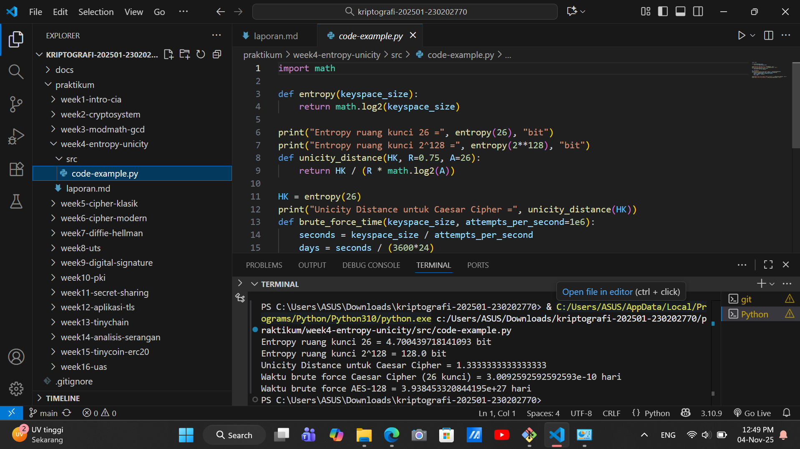

# Laporan Praktikum Kriptografi
Minggu ke-: 4
Topik: [Entropy & Unicity Distance (Evaluasi Kekuatan Kunci dan Brute Force)]  
Nama: [Nanda Erdi Pratama]  
NIM: [230202770]  
Kelas: [5IKRB]  

---

## 1. Tujuan
Setelah mengikuti praktikum ini, mahasiswa diharapkan mampu:  
1. Menyelesaikan perhitungan sederhana terkait entropi kunci.  
2. Menggunakan teorema Euler pada contoh perhitungan modular & invers.  
3. Menghitung unicity distance untuk ciphertext tertentu.  
4. Menganalisis kekuatan kunci berdasarkan entropi dan unicity distance.  
5. Mengevaluasi potensi serangan brute force pada kriptosistem sederhana.

---

## 2. Dasar Teori
Teori Dasar

Entropi kunci mengukur tingkat keacakan dan ketidakpastian suatu kunci kriptografi. Kunci yang memiliki entropi tinggi berarti sangat sulit ditebak karena terdapat banyak kemungkinan kandidat kunci yang sama-sama mungkin. Sebaliknya, entropi rendah menunjukkan pola atau kelemahan dalam pembuatan kunci, membuatnya rentan terhadap serangan bahkan sebelum penyerangan dimulai. Konsep ini membantu mengevaluasi kekuatan dasar suatu sistem kriptografi. Unicity distance adalah jumlah minimum cipherteks yang dibutuhkan agar secara teori hanya ada satu kunci yang dapat menghasilkan plainteks yang bermakna. Setelah melewati jarak unik ini, penyerang dapat menentukan kunci yang benar dengan pasti. Konsep ini menggambarkan batas praktis dimana sistem kriptografi mulai kehilangan keamanannya ketika cukup banyak data terenkripsi yang berhasil dikumpulkan.

Contoh Cipher Klasik dan Aritmetika Modular

Cipher klasik seperti Caesar Cipher bekerja dengan menggeser setiap huruf plainteks berdasarkan nilai kunci. Aritmetika modular digunakan untuk memastikan pergeseran tetap berada dalam rentang huruf alfabet. Misalnya, dengan kunci 3, huruf A digeser menjadi D, B menjadi E, dan seterusnya. Ketika mencapai Z, perhitungan akan kembali ke awal alfabet. Pada Caesar Cipher yang hanya memiliki 26 kemungkinan kunci, sistem ini sangat lemah. Dengan menganalisis beberapa karakter cipherteks saja, penyerang sudah dapat menentukan kunci yang digunakan. Hal ini terjadi karena unicity distance-nya sangat pendek, menunjukkan bahwa cipher sederhana seperti ini mudah dipecahkan dengan analisis frekuensi karakter.

---

## 3. Alat dan Bahan
(- Python 3.x  
- Visual Studio Code / editor lain  
- Git dan akun GitHub  
- Library tambahan (misalnya pycryptodome, jika diperlukan)  )

---

## 4. Langkah Percobaan
(Tuliskan langkah yang dilakukan sesuai instruksi.  
Contoh format:
1. Membuat file `caesar_cipher.py` di folder `praktikum/week2-cryptosystem/src/`.
2. Menyalin kode program dari panduan praktikum.
3. Menjalankan program dengan perintah `python caesar_cipher.py`.)

---

## 5. Source Code
(Salin kode program utama yang dibuat atau dimodifikasi.  
Gunakan blok kode:

```python
import math

def entropy(keyspace_size):
    return math.log2(keyspace_size)

print("Entropy ruang kunci 26 =", entropy(26), "bit")
print("Entropy ruang kunci 2^128 =", entropy(2**128), "bit")
def unicity_distance(HK, R=0.75, A=26):
    return HK / (R * math.log2(A))

HK = entropy(26)
print("Unicity Distance untuk Caesar Cipher =", unicity_distance(HK))
def brute_force_time(keyspace_size, attempts_per_second=1e6):
    seconds = keyspace_size / attempts_per_second
    days = seconds / (3600*24)
    return days

print("Waktu brute force Caesar Cipher (26 kunci) =", brute_force_time(26), "hari")
print("Waktu brute force AES-128 =", brute_force_time(2**128), "hari")
```
)

---

## 6. Hasil dan Pembahasan
(- Lampirkan screenshot hasil eksekusi program (taruh di folder `screenshots/`).  
- Berikan tabel atau ringkasan hasil uji jika diperlukan.  
- Jelaskan apakah hasil sesuai ekspektasi.  
- Bahas error (jika ada) dan solusinya. 

Hasil eksekusi program Caesar Cipher:




)

---

## 7. Jawaban Pertanyaan
(Jawab pertanyaan diskusi yang diberikan pada modul.  
- Pertanyaan 1: Arti Nilai Entropi dalam Kekuatan Kunci:
Entropi mengukur tingkat keacakan dan ketidakpastian dalam sebuah kunci. 
- Entropi tinggi = Kunci sangat acak, tidak dapat diprediksi, dan sulit ditebak. Ini berarti ruang kunci yang mungkin sangat besar, sehingga meningkatkan kekuatan kriptografis.
- Entropi rendah = Kunci memiliki pola atau predictability, yang melemahkan keamanan sistem karena lebih mudah diserang (misalnya, melalui dictionary attack atau brute force pada ruang kunci yang kecil).
Contoh: Kunci 128-bit dengan entropi penuh memiliki 2¹²⁸ kemungkinan kombinasi, sementara kunci dengan entropi efektif hanya 40-bit jauh lebih lemah meskipun panjangnya 128-bit.
- Pertanyaan 2: Unicity distance penting karena menunjukkan batas teoritis di mana ciphertext memberikan informasi yang cukup untuk memecahkan kunci secara unik. Unicity distance pendek = Cipher kurang aman, karena penyerang hanya perlu menganalisis sejumlah kecil ciphertext untuk menemukan kunci yang benar. Unicity distance panjang = Cipher lebih aman, karena penyerang membutuhkan ciphertext yang sangat banyak untuk memiliki peluang memecahkan kunci. Dengan kata lain, unicity distance mengukur kerentanan cipher terhadap analisis statistik: semakin pendek jaraknya, semakin mudah cipher tersebut dibobol melalui analisis cryptoanalitik.
- Pertanyaan 3: Brute force tetap menjadi ancaman karena beberapa alasan praktis:
Kemajuan Teknologi Komputasi: Kekuatan prosesor, GPU, dan komputasi kuantum terus meningkat, memperpendek waktu yang dibutuhkan untuk mencoba semua kemungkinan kunci. Implementasi yang Tidak Sempurna: Kesalahan dalam pembuatan kunci (seperti entropy rendah) atau kelemahan dalam protokol dapat memperkecil ruang kunci yang efektif. Sumber Daya Komputasi Terdistribusi: Penyerang dapat memanfaatkan banyak komputer secara paralel (botnet, cloud computing) untuk mempercepat proses brute force. Kunci yang Lemah: Pengguna mungkin memilih kunci yang pendek atau mudah ditebak, mengurangi waktu yang dibutuhkan untuk brute force. Nature of Brute Force - Serangan ini selalu mungkin dilakukan selama ruang kunci terbatas, dan hanya masalah waktu serta sumber daya komputasi.

)
---

## 8. Kesimpulan

Entropi kunci yang tinggi mutlak diperlukan untuk memaksimalkan kekuatan kriptografis, karena menentukan seberapa tidak terduga sebuah kunci. Unicity distance yang panjang menunjukkan cipher lebih tahan terhadap analisis statistik, memperkuat keamanannya. Namun, ancaman brute force tetap nyata akibat kemajuan komputasi dan implementasi yang lemah, sehingga panjang kunci harus selalu melebihi kapabilitas komputasi penyerang.

---

## 9. Daftar Pustaka
(Cantumkan referensi yang digunakan.  
Contoh:  
- Katz, J., & Lindell, Y. *Introduction to Modern Cryptography*.  
- Stallings, W. *Cryptography and Network Security*.  )

---

## 10. Commit Log

```
commit a5a6e7ceaa34b7143143a9ac911e1576b8973479 (HEAD -> main, origin/main, origin/HEAD)
Author: Nanda0218 <nandaerdipratama29@gmail.com>
Date:   Mon Nov 3 18:48:28 2025 +0700

    week4-entropy-unicity

```
