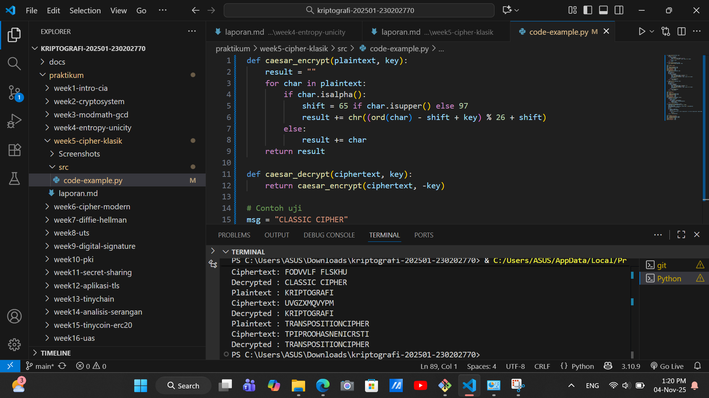

# Laporan Praktikum Kriptografi
Minggu ke-: 5
Topik: [Cipher Klasik (Caesar, Vigenère, Transposisi)]  
Nama: [Nanda Erdi Pratama]  
NIM: [230202770]  
Kelas: [5IKRB]  

---

## 1. Tujuan
Setelah mengikuti praktikum ini, mahasiswa diharapkan mampu:

Menerapkan algoritma Caesar Cipher untuk enkripsi dan dekripsi teks.
Menerapkan algoritma Vigenère Cipher dengan variasi kunci.
Mengimplementasikan algoritma transposisi sederhana.
Menjelaskan kelemahan algoritma kriptografi klasik.

---

## 2. Dasar Teori
Teori Cipher Klasik

Cipher klasik adalah sistem kriptografi tradisional yang bekerja pada karakter individual (biasa huruf alfabet) menggunakan transformasi sederhana tanpa memerlukan komputasi kompleks. Dua kategori utamanya adalah cipher substitusi (mengganti setiap huruf plaintext dengan huruf ciphertext) dan cipher transposisi (mengubah urutan huruf plaintext tanpa mengubah identitas hurufnya). Cipher-cipher ini umumnya bersifat simetris, menggunakan kunci yang sama untuk proses enkripsi dan dekripsi. Caesar cipher merupakan cipher substitusi paling sederhana yang menggunakan konsep modular aritmetika. Setiap huruf plaintext digeser sejumlah posisi tetap dalam alfabet (misal: geser 3, A→D, B→E). Operasi modular (mod 26) memastikan pergeseran tetap dalam rentang alfabet. Sementara Vigenère cipher memperluas konsep ini menggunakan kunci berbasis kata/frasa yang menciptakan multiple shift values, sehingga menghasilkan polyalphabetic substitution yang lebih kuat daripada Caesar cipher. Cipher transposisi mengacak plaintext dengan menyusunnya dalam matriks atau pola tertentu berdasarkan kunci, kemudian membaca ulang sesuai aturan transposisi. Contohnya columnar transposition yang menulis plaintext per kolom kemudian membaca per baris. Keamanan cipher klasik secara umum telah terpecahkan dengan teknik analisis frekuensi dan metode kriptanalisis modern, namun tetap menjadi fondasi penting dalam memahami prinsip-prinsip kriptografi.

---

## 3. Alat dan Bahan
(- Python 3.x  
- Visual Studio Code / editor lain  
- Git dan akun GitHub  
- Library tambahan (misalnya pycryptodome, jika diperlukan)  )

---

## 4. Langkah Percobaan
(Tuliskan langkah yang dilakukan sesuai instruksi.  
Contoh format:
1. Membuat file `caesar_cipher.py` di folder `praktikum/week2-cryptosystem/src/`.
2. Menyalin kode program dari panduan praktikum.
3. Menjalankan program dengan perintah `python caesar_cipher.py`.)

---

## 5. Source Code
(Salin kode program utama yang dibuat atau dimodifikasi.  
Gunakan blok kode:

```python
def caesar_encrypt(plaintext, key):
    result = ""
    for char in plaintext:
        if char.isalpha():
            shift = 65 if char.isupper() else 97
            result += chr((ord(char) - shift + key) % 26 + shift)
        else:
            result += char
    return result

def caesar_decrypt(ciphertext, key):
    return caesar_encrypt(ciphertext, -key)

# Contoh uji
msg = "CLASSIC CIPHER"
key = 3
enc = caesar_encrypt(msg, key)
dec = caesar_decrypt(enc, key)
print("Plaintext :", msg)
print("Ciphertext:", enc)
print("Decrypted :", dec)
def vigenere_encrypt(plaintext, key):
    result = []
    key = key.lower()
    key_index = 0
    for char in plaintext:
        if char.isalpha():
            shift = ord(key[key_index % len(key)]) - 97
            base = 65 if char.isupper() else 97
            result.append(chr((ord(char) - base + shift) % 26 + base))
            key_index += 1
        else:
            result.append(char)
    return "".join(result)

def vigenere_decrypt(ciphertext, key):
    result = []
    key = key.lower()
    key_index = 0
    for char in ciphertext:
        if char.isalpha():
            shift = ord(key[key_index % len(key)]) - 97
            base = 65 if char.isupper() else 97
            result.append(chr((ord(char) - base - shift) % 26 + base))
            key_index += 1
        else:
            result.append(char)
    return "".join(result)

# Contoh uji
msg = "KRIPTOGRAFI"
key = "KEY"
enc = vigenere_encrypt(msg, key)
dec = vigenere_decrypt(enc, key)
print("Plaintext :", msg)
print("Ciphertext:", enc)
print("Decrypted :", dec)
def transpose_encrypt(plaintext, key=5):
    ciphertext = [''] * key
    for col in range(key):
        pointer = col
        while pointer < len(plaintext):
            ciphertext[col] += plaintext[pointer]
            pointer += key
    return ''.join(ciphertext)

def transpose_decrypt(ciphertext, key=5):
    num_of_cols = int(len(ciphertext) / key + 0.9999)
    num_of_rows = key
    num_of_shaded_boxes = (num_of_cols * num_of_rows) - len(ciphertext)
    plaintext = [''] * num_of_cols
    col = 0
    row = 0
    for symbol in ciphertext:
        plaintext[col] += symbol
        col += 1
        if (col == num_of_cols) or (col == num_of_cols - 1 and row >= num_of_rows - num_of_shaded_boxes):
            col = 0
            row += 1
    return ''.join(plaintext)

# Contoh uji
msg = "TRANSPOSITIONCIPHER"
enc = transpose_encrypt(msg, key=5)
dec = transpose_decrypt(enc, key=5)
print("Plaintext :", msg)
print("Ciphertext:", enc)
print("Decrypted :", dec)
```
)

---

## 6. Hasil dan Pembahasan
(- Lampirkan screenshot hasil eksekusi program (taruh di folder `screenshots/`).  
- Berikan tabel atau ringkasan hasil uji jika diperlukan.  
- Jelaskan apakah hasil sesuai ekspektasi.  
- Bahas error (jika ada) dan solusinya. 

Hasil eksekusi program Caesar Cipher:




)

---

## 7. Jawaban Pertanyaan
(Jawab pertanyaan diskusi yang diberikan pada modul.  
- Pertanyaan 1: Kelemahan Utama Caesar Cipher dan Vigenère Cipher
Caesar Cipher: Kelemahan utamanya adalah ruang kunci yang sangat kecil (hanya 25 kemungkinan kunci), sehingga mudah diserang dengan brute force.
Vigenère Cipher: Meski lebih kuat dari Caesar, kelemahan utamanya terletak pada pengulangan kunci. Jika panjang kunci dapat diketahui (misalnya dengan Kasiski examination), cipher ini dapat dipecah menjadi beberapa Caesar cipher yang kemudian mudah diserang dengan analisis frekuensi.
- Pertanyaan 2: Karena cipher klasik (terutama substitusi monoalfabetik) mempertahankan frekuensi karakter dari bahasa aslinya. Dalam sebuah bahasa, setiap huruf memiliki pola frekuensi kemunculan yang statis dan dapat diprediksi (contoh: dalam bahasa Inggris, 'E' adalah huruf yang paling sering muncul). Cipher tersebut hanya menggeser atau mengganti huruf tanpa menghilangkan pola statistik ini, sehingga penyerang dapat mencocokkan frekuensi huruf dalam ciphertext dengan frekuensi huruf dalam bahasa target untuk menemukan kunci substitusinya.
- Pertanyaan 3: Cipher Substitusi memiliki kelebihan karena dapat menyembunyikan hubungan langsung antara huruf plaintext dan ciphertext. Namun, kelemahan utamanya adalah sangat rentan terhadap analisis frekuensi karena pola statistik bahasa asli tetap terbawa dalam ciphertext.
Cipher Transposisi unggul karena dapat menghancurkan pola frekuensi karakter tunggal dengan mengacak urutan huruf. Akan tetapi, cipher ini tetap mempertahankan distribusi frekuensi gabungan (seperti digram dan trigram) sehingga masih rentan terhadap analisis frekuensi yang lebih canggih.
)
---

## 8. Kesimpulan
Cipher klasik seperti Caesar dan Vigenère terbukti rentan karena mempertahankan pola statistik bahasa asli, sehingga mudah dipecahkan dengan analisis frekuensi. Cipher transposisi sedikit lebih unggul dengan mengacak urutan huruf, namun tetap meninggalkan jejak statistik yang dapat dianalisis. Secara keseluruhan, cipher-cipher ini tidak lagi aman untuk penggunaan praktis karena ketergantungannya pada kerahasiaan algoritma dan kerentanan terhadap metode kriptanalisis modern.

---

## 9. Daftar Pustaka
(Cantumkan referensi yang digunakan.  
Contoh:  
- Katz, J., & Lindell, Y. *Introduction to Modern Cryptography*.  
- Stallings, W. *Cryptography and Network Security*.  )

---

## 10. Commit Log

```
commit 934821b8a524773fc90e38e1f5dbcc87b53f02ef (HEAD -> main, origin/main)
Author: Nanda0218 <nandaerdipratama29@gmail.com>
Date:   Tue Nov 4 13:38:34 2025 +0700

    week5-cipher-klasik

```
