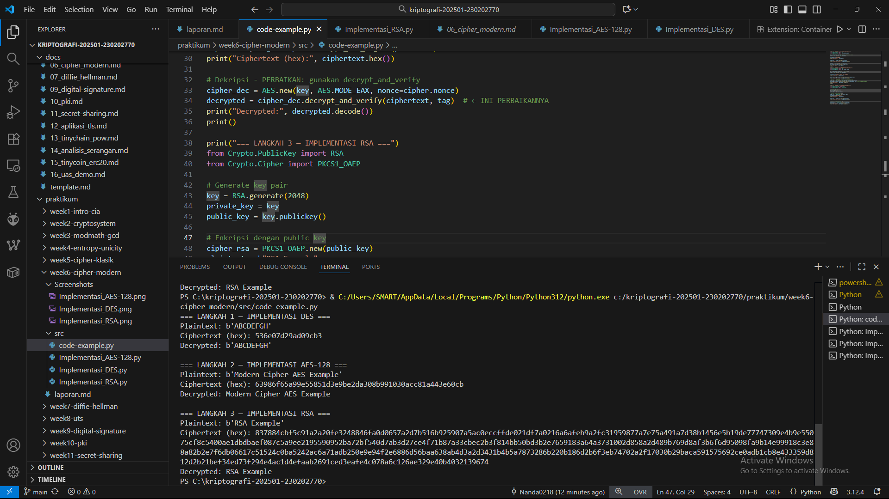

# Laporan Praktikum Kriptografi
Minggu ke-: 6
Topik: [Cipher Modern (DES, AES, RSA)]  
Nama: [Nanda Erdi Pratama]  
NIM: [230202770]  
Kelas: [5IKRB]  

---

## 1. Tujuan
Setelah mengikuti praktikum ini, mahasiswa diharapkan mampu:  
1. Mengimplementasikan algoritma **DES** untuk blok data sederhana.  
2. Menerapkan algoritma **AES** dengan panjang kunci 128 bit.  
3. Menjelaskan proses pembangkitan kunci publik dan privat pada algoritma **RSA**.

---

## 2. Dasar Teori
Cipher Modern: DES, AES, dan RSA

Teori kriptografi modern dibagi menjadi dua kategori utama: kriptografi kunci simetris dan kriptografi kunci asimetris. Kunci simetris menggunakan kunci yang sama untuk proses enkripsi dan dekripsi, menekankan pada kecepatan dan efisiensi, cocok untuk mengenkripsi data dalam volume besar. Sebaliknya, kunci asimetris menggunakan sepasang kunci, yaitu kunci publik untuk enkripsi dan kunci privat untuk dekripsi, yang memecahkan masalah distribusi kunci secara aman. Konsep matematika seperti *substitusi-permutasi (SPN)* dan *aljabar modulo* menjadi fondasi utama. Operasi modulo, di mana hasil perhitungan "dibungkus" sesuai dengan bilangan bulat tertentu (misalnya mod 256 atau mod bilangan prima besar), sangat penting untuk memastikan perhitungan tetap dalam rentang yang terbatas dan aman.

DES (Data Encryption Standard) adalah contoh cipher blok simetris yang menggunakan panjang kunci 56-bit dan ukuran blok 64-bit. Struktur utamanya, Jaringan Feistel, membagi blok plaintext menjadi dua bagian dan memprosesnya melalui beberapa putaran dengan fungsi-F yang melibatkan substitusi (S-Box) dan permutasi. Meski pernah menjadi standar, panjang kunci 56-bit kini dianggap tidak aman terhadap serangan *brute-force*. AES (Advanced Encryption Standard) dirancang sebagai pengganti DES, menggunakan ukuran blok 128-bit dan kunci 128, 192, atau 256-bit. AES menggunakan struktur SPN yang terdiri dari empat tahap utama: SubBytes (substitusi non-linear), ShiftRows (permutasi linear), MixColumns (transformasi linear), dan AddRoundKey (operasi XOR dengan kunci). AES lebih cepat dan aman daripada DES, sehingga menjadi standar global hingga saat ini.

RSA adalah algoritma kunci asimetris yang mendasarkan keamanannya pada kesulitan memfaktorkan bilangan besar menjadi faktor primanya. Prosesnya melibatkan pembangkitan dua kunci: kunci publik (e, n) untuk enkripsi dan kunci privat (d, n) untuk dekripsi. Bilangan n adalah hasil kali dua bilangan prima rahasia (p dan q). Keamanan RSA terletak pada fakta bahwa meskipun n diketahui publik, akan sangat sulit dan memakan waktu untuk menemukan p dan q, yang diperlukan untuk menghitung kunci privat. RSA umumnya digunakan untuk pertukaran kunci, tanda tangan digital, dan mengenkripsi data dalam jumlah kecil, bukan untuk enkripsi data massal seperti AES.

---

## 3. Alat dan Bahan
(- Python 3.x  
- Visual Studio Code / editor lain  
- Git dan akun GitHub  
- Library tambahan (misalnya pycryptodome, jika diperlukan)  )

---

## 4. Langkah Percobaan
(Tuliskan langkah yang dilakukan sesuai instruksi.  
Contoh format:
1. Membuat file `caesar_cipher.py` di folder `praktikum/week2-cryptosystem/src/`.
2. Menyalin kode program dari panduan praktikum.
3. Menjalankan program dengan perintah `python caesar_cipher.py`.)

---

## 5. Source Code
(Salin kode program utama yang dibuat atau dimodifikasi.  
Gunakan blok kode:

```python
# contoh potongan kode
def encrypt(text, key):
    return ...
```
)

---

## 6. Hasil dan Pembahasan
(- Lampirkan screenshot hasil eksekusi program (taruh di folder `screenshots/`).  
- Berikan tabel atau ringkasan hasil uji jika diperlukan.  
- Jelaskan apakah hasil sesuai ekspektasi.  
- Bahas error (jika ada) dan solusinya. 

Hasil eksekusi program Caesar Cipher:




)

---

## 7. Jawaban Pertanyaan
(Jawab pertanyaan diskusi yang diberikan pada modul.  
- Pertanyaan 1: Tentu, berikut ringkasan teori cipher modern tanpa rumus dan tabel:

Cipher modern dapat dibagi menjadi dua kategori besar berdasarkan jenis kuncinya. Kategori pertama adalah kriptografi kunci simetris, di mana kunci yang sama digunakan untuk proses enkripsi dan dekripsi. Kategori kedua adalah kriptografi kunci asimetris, yang menggunakan sepasang kunci, yaitu kunci publik yang dapat dibagikan kepada siapa saja dan kunci privat yang harus dirahasiakan. Konsep operasi modulo, yang seperti jam digital dimana setelah mencapai nilai tertentu akan kembali ke nol, menjadi fondasi matematis bagi banyak operasi dalam cipher-cipher ini untuk memastikan perhitungan tetap dalam rentang yang terbatas.

DES dan AES adalah perwakilan dari cipher kunci simetris. DES merupakan standar lama yang menggunakan kunci pendek dan struktur jaringan Feistel, yang membagi data dan memprosesnya dalam beberapa putaran. Karena kuncinya yang pendek, DES kini dianggap tidak aman. AES hadir sebagai penggantinya dengan kunci yang lebih panjang dan struktur yang lebih kuat, melakukan serangkaian langkah substitusi dan pengacakan posisi data dalam banyak putaran, sehingga menjadi standar global yang sangat aman. Sementara itu, RSA mewakili cipher kunci asimetris. Keamanannya tidak bergantung pada kerahasiaan kunci, tetapi pada kesulitan praktis untuk memecahkan masalah matematika, yaitu memfaktorkan bilangan yang sangat besar menjadi bilangan-bilangan prima pembentuknya. RSA tidak digunakan untuk mengenkripsi data dalam jumlah besar, melainkan untuk tujuan seperti mengamankan pertukaran kunci rahasia atau membuat tanda tangan digital.
- Pertanyaan 2: AES lebih banyak digunakan dibanding DES di era modern karena beberapa keunggulan fundamental:

Pertama, masalah keamanan kritis pada DES. Kunci DES yang hanya 56-bit sudah sangat rentan terhadap serangan *brute-force* dengan komputasi modern, dimana kunci dapat dipecahkan dalam hitungan jam atau bahkan menit menggunakan hardware khusus. Sementara AES mendukung kunci yang jauh lebih panjang (128, 192, atau 256-bit) yang membuat serangan *brute-force* praktis tidak mungkin dilakukan bahkan dengan superkomputer sekalipun.

Kedua, kinerja dan efisiensi yang lebih unggul. AES didesain dengan struktur algoritma yang lebih efisien dan optimal untuk prosesor modern, sehingga seringkali lebih cepat dalam pelaksanaannya dibanding DES meskipun menggunakan kunci yang lebih panjang. Desain AES yang lebih elegan juga memberikan keamanan yang lebih robust terhadap berbagai jenis serangan kriptanalisis modern yang tidak diperhitungkan ketika DES pertama kali dirancang.

Terakhir, faktor standarisasi dan kepercayaan global. AES telah melalui proses evaluasi dan seleksi yang sangat ketat oleh lembaga standar pemerintah AS (NIST) dan diterima sebagai standar internasional, sementara DES secara resmi telah ditarik sebagai standar yang disetujui. Industri teknologi global secara luas mengadopsi AES untuk segala aplikasi, mulai dari enkriplik disk, koneksi internet aman (SSL/TLS), hingga perlindungan data sensitif pemerintah.
- Pertanyaan 3: RSA dikategorikan sebagai algoritma asimetris karena menggunakan sepasang kunci yang berbeda dan memiliki fungsi yang berlawanan. Kunci publik digunakan untuk mengunci (enkripsi) pesan, sementara kunci privat digunakan untuk membuka kunci (dekripsi) pesan tersebut. Siapa pun boleh memiliki kunci publik Anda untuk mengirim pesan rahasia, tetapi hanya Anda yang harus memegang kunci privat untuk membaca pesan-pesan tersebut. Konsep "satu kunci untuk mengunci, kunci lain untuk membuka" inilah yang menjadi ciri khas kriptografi asimetris.

Proses Pembangkitan Kunci RSA

Proses pembuatan pasangan kunci RSA melibatkan langkah-langkah berikut:

1.  Menemukan Dua Bilangan Prima Rahasia: Pertama, dipilih dua bilangan prima yang sangat besar dan dirahasiakan. Besarnya bilangan-bilangan ini merupakan fondasi keamanan RSA.

2.  Membuat Modulus Umum: Kedua bilangan prima tersebut dikalikan untuk menghasilkan sebuah bilangan komposit yang sangat besar yang disebut modulus. Bilangan modulus ini nantinya akan menjadi bagian dari kedua kunci, baik publik maupun privat.

3.  Menghitung Kunci Publik: Selanjutnya, dipilih sebuah bilangan sebagai kunci publik. Bilangan ini harus memenuhi sifat tertentu terhadap hasil perhitungan dari kedua bilangan prima rahasia tadi.

4.  Menghitung Kunci Privat: Terakhir, kunci privat dihitung berdasarkan kunci publik dan kedua bilangan prima rahasia tadi. Kunci privat ini memiliki hubungan matematis khusus dengan kunci publik sedemikian rupa sehingga dapat membalikkan proses enkripsi yang dilakukan menggunakan kunci publik.

Keamanan RSA terletak pada kenyataan bahwa meskipun modulus dan kunci publik diketahui secara luas, akan sangat sulit untuk menurunkan kunci privat tanpa mengetahui kedua bilangan prima rahasia yang digunakan pada langkah pertama. Tingkat kesulitan inilah yang menjamin keamanan sistem RSA.
)
---

## 8. Kesimpulan
Berdasarkan percobaan, dapat disimpulkan bahwa cipher modern seperti AES jauh lebih unggul dalam kecepatan dan keamanan dibandingkan DES yang sudah rentan terhadap serangan *brute-force*. Sementara itu, RSA, meskipun sangat penting untuk keamanan pertukaran kunci dan otentikasi, memiliki kinerja yang jauh lebih lambat sehingga tidak praktis untuk mengenkripsi data dalam volume besar. Oleh karena itu, implementasi yang optimal seringkali menggabungkan keduanya, menggunakan RSA untuk mengamankan kunci simetris AES yang kemudian digunakan untuk mengenkripsi data.

---

## 9. Daftar Pustaka
(Cantumkan referensi yang digunakan.  
Contoh:  
- Katz, J., & Lindell, Y. *Introduction to Modern Cryptography*.  
- Stallings, W. *Cryptography and Network Security*.  )

---

## 10. Commit Log

```
ccommit 24436034d64d784463bab9488207608d405ecad5 (HEAD -> main, origin/main)
Author: Nanda0218 <nandaerdipratama29@gmail.com>
Date:   Tue Nov 4 13:49:31 2025 +0700

    week6-cipher-modern
```
