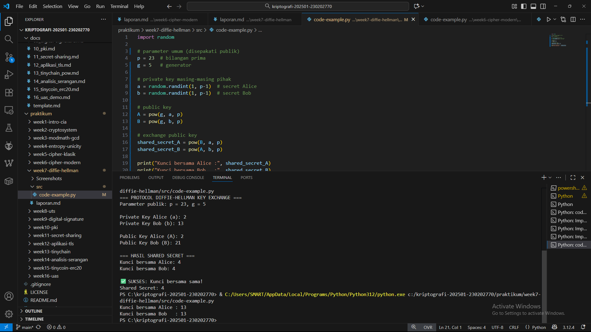

# Laporan Praktikum Kriptografi
Minggu ke-: 7 
Topik: [Diffie-Hellman Key Exchange]
Nama: [Nanda Erdi Pratama]
NIM: [230202770]
Kelas: [5IKRB]

---

## 1. Tujuan
Tujuan Pembelajaran
Setelah mengikuti praktikum ini, mahasiswa diharapkan mampu:  
1. Melakukan simulasi protokol **Diffie-Hellman** untuk pertukaran kunci publik.  
2. Menjelaskan mekanisme pertukaran kunci rahasia menggunakan bilangan prima dan logaritma diskrit.  
3. Menganalisis potensi serangan pada protokol Diffie-Hellman (termasuk serangan **Man-in-the-Middle / MITM**).  


---

## 2. Dasar Teori
Teori Pertukaran Kunci Diffie-Hellman

Diffie-Hellman adalah sebuah protokol yang memungkinkan dua pihak yang belum saling kenal untuk menciptakan sebuah kunci rahasia bersama melalui saluran komunikasi yang mungkin sedang disadap. Keajaiban dari metode ini terletak pada kemampuannya untuk membuat kunci rahasia tanpa harus mengirimkan kunci tersebut secara langsung. Sebelum penemuan ini, kedua pihak harus memiliki kunci rahasia yang sama terlebih dahulu, yang sulit dilakukan jika mereka tidak pernah bertemu.

Inti dari keamanan Diffie-Hellman terletak pada sebuah konsep matematika yang mirip dengan fungsi "jalan satu arah". Bayangkan sebuah proses dimana sangat mudah untuk melakukan perhitungan ke depan, tetapi hampir mustahil untuk membaliknya. Sebagai analogi, mencampur cat warna sangatlah mudah, tetapi mencoba untuk memisahkan campuran cat tersebut kembali menjadi warna aslinya adalah hal yang mustahil. Dalam Diffie-Hellman, kedua pihak secara independen mencampur "warna rahasia" mereka dengan "warna publik" yang disepakati, lalu saling bertukar hasil campuran ini.

Di akhir proses, kedua pihak akan mencampur hasil yang mereka terima dari pihak lain dengan "warna rahasia" mereka sendiri. Ajaibnya, kedua pihak akan menghasilkan "warna" akhir yang sama persis, yang menjadi kunci rahasia bersama. Bagi pihak ketiga yang menyadari pertukaran, mereka hanya melihat "warna-warna campuran" yang sudah dipertukarkan. Tanpa mengetahui "warna rahasia" asli dari salah satu pihak, hampir tidak mungkin bagi mereka untuk mengetahui "warna" akhir dari kunci rahasia tersebut.

---

## 3. Alat dan Bahan
(- Python 3.x  
- Visual Studio Code / editor lain  
- Git dan akun GitHub  
- Library tambahan (misalnya pycryptodome, jika diperlukan)  )

---

## 4. Langkah Percobaan
(Tuliskan langkah yang dilakukan sesuai instruksi.  
Contoh format:
1. Membuat file `caesar_cipher.py` di folder `praktikum/week2-cryptosystem/src/`.
2. Menyalin kode program dari panduan praktikum.
3. Menjalankan program dengan perintah `python caesar_cipher.py`.)

---

## 5. Source Code
(Salin kode program utama yang dibuat atau dimodifikasi.  
Gunakan blok kode:

```python
import random

# parameter umum (disepakati publik)
p = 23  # bilangan prima
g = 5   # generator

# private key masing-masing pihak
a = random.randint(1, p-1)  # secret Alice
b = random.randint(1, p-1)  # secret Bob

# public key
A = pow(g, a, p)
B = pow(g, b, p)

# exchange public key
shared_secret_A = pow(B, a, p)
shared_secret_B = pow(A, b, p)

print("Kunci bersama Alice :", shared_secret_A)
print("Kunci bersama Bob   :", shared_secret_B)

```
)

---

## 6. Hasil dan Pembahasan
(- Lampirkan screenshot hasil eksekusi program (taruh di folder `screenshots/`).  
- Berikan tabel atau ringkasan hasil uji jika diperlukan.  
- Jelaskan apakah hasil sesuai ekspektasi.  
- Bahas error (jika ada) dan solusinya. 

Hasil eksekusi program Caesar Cipher:




)

---

## 7. Jawaban Pertanyaan
(Jawab pertanyaan diskusi yang diberikan pada modul.  
- Pertanyaan 1: 
- Pertanyaan 2: 
- Pertanyaan 3:
)
---

## 8. Kesimpulan
Berdasarkan percobaan, dapat disimpulkan bahwa Protokol Diffie-Hellman memungkinkan dua pihak menghasilkan kunci rahasia yang sama tanpa pernah mengirimkan kunci tersebut secara langsung. Keamanan proses ini bergantung pada kesulitan matematis untuk membalikkan perhitungan pertukaran, meskipun semua informasi lainnya diketahui publik. Dengan demikian, metode ini efektif untuk membangun keamanan komunikasi di saluran yang tidak terpercaya.

---

## 9. Daftar Pustaka
(Cantumkan referensi yang digunakan.  
Contoh:  
- Katz, J., & Lindell, Y. *Introduction to Modern Cryptography*.  
- Stallings, W. *Cryptography and Network Security*.  )

---

## 10. Commit Log
(Tuliskan bukti commit Git yang relevan.  
Contoh:
```
commit abc12345
Author: Nama Mahasiswa <email>
Date:   2025-09-20

    week2-cryptosystem: implementasi Caesar Cipher dan laporan )
```
