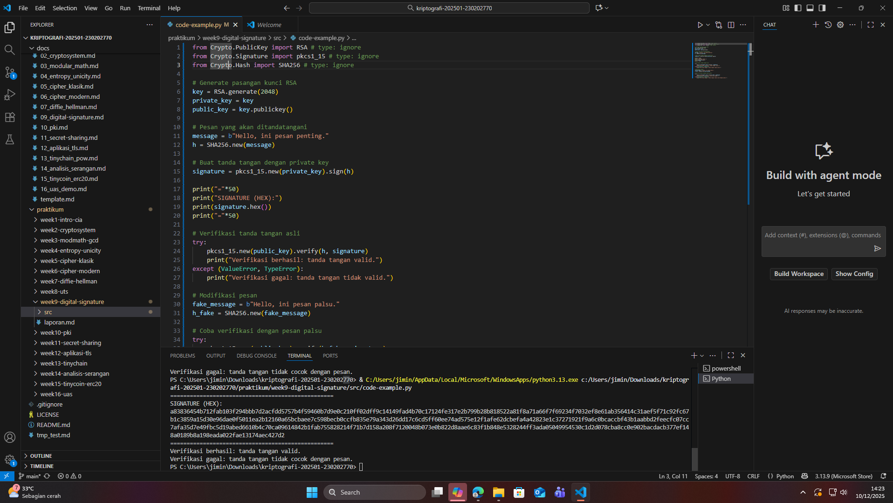

# Laporan Praktikum Kriptografi
Minggu ke-: 9 
Topik: [Digital Signature (RSA/DSA)]  
Nama: [Nanda Erdi Pratama]  
NIM: [230202770]  
Kelas: [5IKRB]  

---

## 1. Tujuan
Tujuan Pembelajaran
Setelah mengikuti praktikum ini, mahasiswa diharapkan mampu:  
1. Mengimplementasikan tanda tangan digital menggunakan algoritma RSA/DSA.  
2. Memverifikasi keaslian tanda tangan digital.  
3. Menjelaskan manfaat tanda tangan digital dalam otentikasi pesan dan integritas data.

---

## 2. Dasar Teori

Digital signature adalah teknik kriptografi yang digunakan untuk memastikan bahwa pesan atau dokumen digital benar-benar dibuat oleh pengirim yang sah dan tidak mengalami perubahan. Sistem ini menggunakan pasangan kunci asimetris: private key untuk menandatangani, dan public key untuk memverifikasi tanda tangan tersebut. Prosesnya selalu melibatkan fungsi hash yang mengubah pesan menjadi jejak digital unik, sehingga verifikasi dapat dilakukan dengan cepat dan aman.

Pada RSA, keamanan digital signature bergantung pada kesulitan memecahkan masalah faktorisasi bilangan besar. Private key pemilik digunakan untuk membuat tanda tangan digital, sementara public key dapat digunakan siapa saja untuk memeriksa keasliannya. RSA dikenal sederhana dalam konsep dan umum digunakan karena kompatibel dengan banyak sistem keamanan modern. 

---

## 3. Alat dan Bahan
(- Python 3.x  
- Visual Studio Code / editor lain  
- Git dan akun GitHub  
- Library tambahan (misalnya pycryptodome, jika diperlukan)  )

---

## 4. Langkah Percobaan
(Tuliskan langkah yang dilakukan sesuai instruksi.  
Contoh format:
1. Membuat file `caesar_cipher.py` di folder `praktikum/week2-cryptosystem/src/`.
2. Menyalin kode program dari panduan praktikum.
3. Menjalankan program dengan perintah `python caesar_cipher.py`.)

---

## 5. Source Code
(Salin kode program utama yang dibuat atau dimodifikasi.  
Gunakan blok kode:

```python
# contoh potongan kode
def encrypt(text, key):
    return ...
```
)

---

## 6. Hasil dan Pembahasan
(- Lampirkan screenshot hasil eksekusi program (taruh di folder `screenshots/`).  
- Berikan tabel atau ringkasan hasil uji jika diperlukan.  
- Jelaskan apakah hasil sesuai ekspektasi.  
- Bahas error (jika ada) dan solusinya. 

Hasil eksekusi program Caesar Cipher:




)

---

## 7. Jawaban Pertanyaan  
- Pertanyaan 1: Perbedaan Utama
1. Tujuan
* Enkripsi RSA: menjaga kerahasiaan pesan agar hanya penerima yang bisa membaca.
* Tanda tangan digital RSA: memastikan *keaslian* dan *integritas* pesan serta membuktikan siapa pengirimnya.

2. Kunci yang Digunakan
* Enkripsi RSA: pengirim memakai public key penerima untuk mengenkripsi, penerima membuka dengan private key.
* Tanda tangan digital RSA: pengirim membuat tanda tangan dengan private key, penerima memverifikasi dengan public key pengirim.

3. Apa yang Dilindungi
* Enkripsi RSA melindungi isi pesan dari orang lain.
* Tanda tangan digital RSA melindungi identitas pengirim dan memastikan pesan tidak dimodifikasi.

4. Contoh Sederhana
* Enkripsi: Alice ingin mengirim pesan rahasia ke Bob → ia mengenkripsi pakai public key Bob.
* Tanda tangan: Alice ingin membuktikan bahwa pesan benar dari dia → ia menandatangani pakai private key-nya, dan Bob memverifikasi dengan public key Alice.

- Pertanyaan 2: Tanda tangan digital menjamin integritas dan otentikasi pesan karena menggunakan kombinasi private key pengirim dan hash pesan. Mari kita uraikan dengan jelas:

1. Integritas

* Tanda tangan digital dibuat dari hash pesan, bukan dari pesan itu sendiri.
* Hash adalah representasi unik dari isi pesan.
* Saat penerima memverifikasi tanda tangan:
  1. Penerima menghitung hash pesan yang diterima.
  2. Membandingkannya dengan hash yang didekripsi dari tanda tangan menggunakan public key pengirim.
* Jika pesan diubah sedikit saja, hash akan berbeda → verifikasi gagal.

kesimpulan: Pesan tidak bisa diubah tanpa terdeteksi. Itu sebabnya integritas dijamin.

2. Otentikasi

* Tanda tangan dibuat menggunakan private key pengirim.
* Hanya pemilik private key yang dapat membuat tanda tangan yang valid.
* Penerima menggunakan public key pengirim untuk memverifikasi.
* Jika verifikasi berhasil, penerima tahu dengan pasti siapa pengirimnya.

Kesimpulan: Tanda tangan digital membuktikan identitas pengirim, sehingga otentikasi dijamin.

- Pertanyaan 3:  Certificate Authority (CA) memiliki peran kritis dalam sistem tanda tangan digital modern, karena tanpa CA, tanda tangan digital sendiri hanya bisa membuktikan hubungan dengan kunci, bukan identitas nyata seseorang atau organisasi. Berikut penjelasan lengkapnya:

1. Otentikasi Identitas
* CA bertindak sebagai pihak percaya (trusted third party) yang memverifikasi identitas individu, perusahaan, atau server sebelum mengeluarkan sertifikat digital.
* Sertifikat digital berisi public key dan informasi identitas pemilik (misal nama, organisasi, domain).
* Dengan sertifikat dari CA, penerima bisa yakin bahwa public key benar-benar milik orang atau entitas yang disebutkan, bukan orang lain.

2. Membuat Public Key Terpercaya*
* Dalam tanda tangan digital, penerima perlu memverifikasi tanda tangan menggunakan public key pengirim.
* Tanpa CA, penerima harus percaya begitu saja bahwa public key yang diterima memang milik pengirim.
* CA menandatangani sertifikat digital pengirim dengan private key CA.
* Penerima memverifikasi sertifikat ini menggunakan public key CA (yang sudah dipercaya), sehingga keaslian public key pengirim dijamin.

3. Mendukung Integritas dan Non-repudiation
* Sertifikat CA membantu memastikan integritas public key.
* Jika public key diubah atau dipalsukan, verifikasi sertifikat CA gagal → penerima tahu ada masalah.
* Ini juga mendukung non-repudiation, karena tanda tangan digital yang dibuat dengan private key pengirim dapat diverifikasi melalui sertifikat yang sah.

4. Contoh Penggunaan
* HTTPS / SSL: browser memverifikasi sertifikat server dari CA sebelum membuat koneksi aman.
* Email S/MIME: email yang ditandatangani digital diverifikasi lewat sertifikat CA.
* Dokumen digital: dokumen resmi yang ditandatangani digital bisa diverifikasi identitas penandatangan via CA.

* CA adalah pihak tepercaya yang memverifikasi identitas dan mengikatnya ke public key.
* Membuat sistem tanda tangan digital menjadi aman, dapat dipercaya, dan valid secara hukum.
* Tanpa CA, tanda tangan digital hanya membuktikan hubungan dengan kunci, tapi tidak menjamin identitas pengirim.

## 8. Kesimpulan
Berdasarkan percobaan dengan tanda tangan digital menggunakan RSA/DSA, dapat disimpulkan bahwa tanda tangan digital berhasil memastikan integritas dan otentikasi pesan, karena verifikasi berhasil untuk pesan asli dan gagal untuk pesan yang diubah. Selain itu, tanda tangan yang dibuat dengan private key hanya bisa diverifikasi menggunakan public key yang sesuai, sehingga membuktikan identitas pengirim.


---

## 9. Daftar Pustaka
(Cantumkan referensi yang digunakan.  
Contoh:  
- Katz, J., & Lindell, Y. *Introduction to Modern Cryptography*.  
- Stallings, W. *Cryptography and Network Security*.  )

---

## 10. Commit Log

```
commit cf11f0387e2c48ecb1bd91ca288565ecb0d3caa4 (HEAD -> main, origin/main, origin/HEAD)
Author: Nanda0218 <nandaerdipratama29@gmail.com>
Date:   Wed Dec 10 14:29:04 2025 +0700

    week9-digital-signature
```
